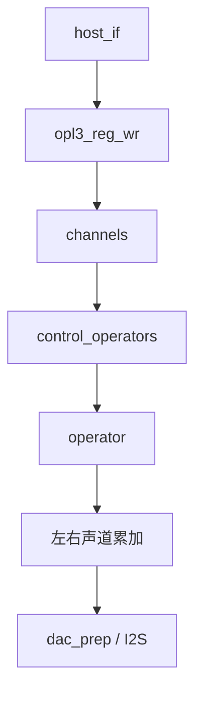
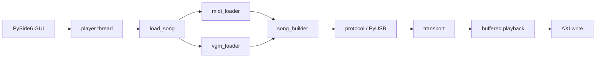
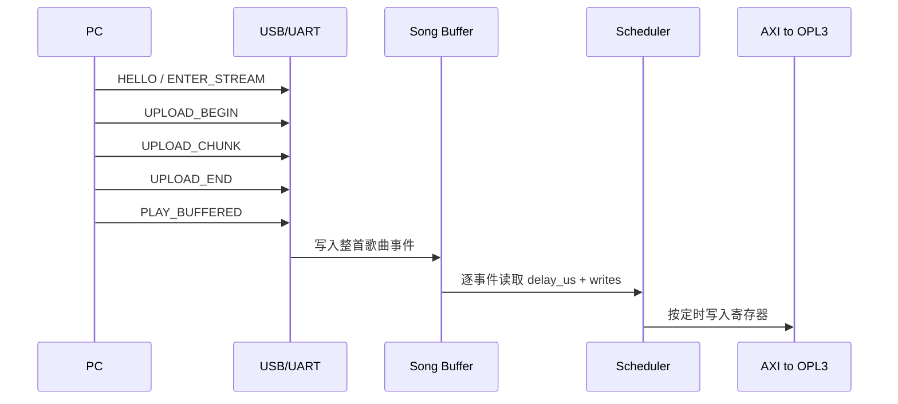

<div align="center">

# Zybo OPL3 FPGA

Zybo 平台上的 OPL3 FPGA 工程  
当前仓库整理为 `Vivado / Vitis 2025.2` 版本

<p>
  
  
  
  
  
</p>


</div>

## 上游项目

- `gtaylormb/opl3_fpga`: <https://github.com/gtaylormb/opl3_fpga>
- `SudoMaker/midi2vgm`: <https://github.com/SudoMaker/midi2vgm>

本仓库基于 `gtaylormb/opl3_fpga` 整理，补充了 `Vivado/Vitis 2025.2` 构建路径，以及 PC 侧 `.mid/.midi/.vgm/.vgz` 播放支持。

## 目录

- [项目概览](#项目概览)
- [当前范围](#当前范围)
- [快速开始](#快速开始)
- [硬件架构](#硬件架构)
- [OPL3 核心细节](#opl3-核心细节)
- [软件架构](#软件架构)
- [文件格式支持](#文件格式支持)
- [串口 CLI](#串口-cli)
- [仓库结构](#仓库结构)
- [构建与运行](#构建与运行)
- [当前状态](#当前状态)
- [限制](#限制)
- [参考资料](#参考资料)

## 项目概览

| 项目项 | 当前方案 |
| --- | --- |
| 开发板 | `Digilent Zybo (Zynq-7000)` |
| FPGA 工具链 | `Vivado 2025.2` |
| PS 软件工具链 | `Vitis 2025.2` |
| 板端运行时 | `standalone bare-metal` |
| 上位机 | `Python + PySide6 + PyUSB` |
| 默认下载方式 | `JTAG` |
| 主通信链路 | `USB Bulk` |
| 回退链路 | `UART` |
| 音频输出 | `I2S -> SSM2603` |

未纳入当前范围：

- `Linux`
- `PetaLinux`
- `USB Audio / UAC`
- 以 `BOOT.bin / SD 卡` 作为日常开发前提

## 当前范围

当前仓库包含以下整理项：

- 适配 `Vivado/Vitis 2025.2`
- 保留板端 `.dro/.imf` 播放路径
- 新增 PC 侧中文 GUI
- 支持 `.mid/.midi/.vgm/.vgz`
- 采用“预加载到板端内存后再播放”的方式
- 补充当前工程导出的 `BD / RTL` 图

## 快速开始

### 环境要求

Windows 环境建议具备：

- `Vivado 2025.2`
- `Vitis 2025.2`
- `Python 3.11+`
- Zybo JTAG 驱动
- 若使用 USB 上位机播放：为设备安装 `WinUSB`

Python 依赖：

```bash
pip install -r pc_player/requirements.txt
```

### 构建硬件

```bash
cd fpga
make bitstream
```

输出：

- `fpga/build/opl3.bit`
- `fpga/build/opl3.xsa`

### 构建板端软件

```bash
vitis -s software/vitis_builder.py
```

输出：

- `vitis_project/imfplay_port/build/imfplay_port.elf`

### JTAG 下载

```powershell
powershell -ExecutionPolicy Bypass -File software/jtag/run_jtag.ps1
```

也可以显式指定文件：

```powershell
powershell -ExecutionPolicy Bypass -File software/jtag/run_jtag.ps1 `
  -Bitstream fpga/build/opl3.bit `
  -Elf vitis_project/imfplay_port/build/imfplay_port.elf
```

### 启动上位机

源码运行：

```bash
python pc_player/main.py
```

打包版本：

- `dist/ZyboOpl3Player/ZyboOpl3Player.exe`

### 基本使用流程

1. 通过 JTAG 下载 `bitstream` 和 `ELF`
2. 将板子切换到 USB 连接方式并接入电脑
3. 打开上位机
4. 选择 USB 设备
5. 选择本地 `.mid/.midi/.vgm/.vgz`
6. 点击播放

## 硬件架构

### 顶层数据通路


### Vivado Block Design

当前工程导出的 Block Design 图如下：

<div align="center">
  
</div>

关联文件：

- [design_1.pdf](fpga/build/design_1/design_1.pdf)
- [block_design.png](docs/block_design.png)

### `opl3_fpga_v2_0`

`opl3_fpga_v2_0` 位于 PS 与 OPL3 核之间，主要包含：

- `AXI4-Lite` 从接口
- `opl3`
- `i2s`

相关源码：

- [opl3_fpga_v2_0.sv](/J:/lumia/OPL3/opl3_fpga/fpga/modules/opl3_fpga_2_0/src/opl3_fpga_v2_0.sv:1)
- [opl3_fpga_v2_0_S_AXI.v](/J:/lumia/OPL3/opl3_fpga/fpga/modules/opl3_fpga_2_0/src/opl3_fpga_v2_0_S_AXI.v:1)

RTL 图：

<div align="center">
  
</div>

关联文件：

- [opl3_fpga_v2_0_rtl.pdf](fpga/build/opl3_fpga_v2_0_rtl.pdf)

### `opl3`

`opl3` 顶层模块包含：

- `host_if`
- `clk_div`
- `channels`
- `leds`
- `timers`

相关源码：

- [opl3.sv](/J:/lumia/OPL3/opl3_fpga/fpga/modules/top_level/src/opl3.sv:1)
- [channels.sv](/J:/lumia/OPL3/opl3_fpga/fpga/modules/channels/src/channels.sv:1)
- [operator.sv](/J:/lumia/OPL3/opl3_fpga/fpga/modules/operator/src/operator.sv:1)

RTL 图：

<div align="center">
  
</div>

关联文件：

- [opl3_core_rtl.pdf](fpga/build/opl3_core_rtl.pdf)

### OPL3 核心层次



模块职责：

- `host_if`：主机寄存器接口
- `control_operators`：运算器调度与连接控制
- `operator`：相位、包络、查表等 FM 运算
- `channels`：2-op / 4-op / 鼓组与左右声道混合

## OPL3 核心细节

这一节只保留模块级视角，不再展开到触发器和查找表级原理图。README 内展示三层：

1. `Zynq Block Design`
2. `opl3_fpga_v2_0` AXI 包装层
3. `opl3` 核心顶层

如果要继续往下看 `operator`、`phase_generator`、`envelope_generator` 的门级/寄存器级图，建议直接在 Vivado 中打开 `Open Elaborated Design` 或 `Open Synthesized Design` 查看。

### 1. Zynq Block Design

这一级描述的是整个板级系统如何把 PS、AXI、音频 Codec 和 OPL3 IP 连起来：

- `processing_system7_0` 负责 ARM、DDR、MIO、UART、FCLK 和 AXI 主设备
- `axi_interconnect_0` 把 PS 的 GP0 总线接到自定义 OPL3 IP
- `opl3_fpga_v2_0_0` 提供 AXI-Lite 寄存器接口，并输出 I2S 与静音控制
- `rst_ps7_0_100M` 统一管理 AXI 外设复位

<div align="center">
  
</div>

关联文件：

- [design_1.pdf](fpga/build/design_1/design_1.pdf)

### 2. `opl3_fpga_v2_0` 包装层

这一级是自定义 IP 的顶层连接图，重点是把 AXI4-Lite 写时序翻译成 OPL3 Host Bus，再把 OPL3 的并行采样送进 I2S 发射器：

- `opl3_fpga_v2_0_S_AXI`
  - 处理 `AW/W/B` 与 `AR/R` 通道
  - 生成 `address`、`din`、`cs_n`、`wr_n`、`rd_n`
- `opl3`
  - 接收 OPL3 风格寄存器写入
  - 输出 `sample_l/sample_r/sample_valid`
- `i2s`
  - 把左右声道 PCM 串行化到 `i2s_sclk/i2s_ws/i2s_sd`

<div align="center">
  
</div>

关联文件：

- [opl3_fpga_v2_0_rtl.pdf](fpga/build/opl3_fpga_v2_0_rtl.pdf)

### 3. `opl3` 核心顶层

这一级展示 FM 合成核心内部的主模块关系：

- `host_if`
  - 接收 Host Bus 寄存器访问
  - 解析地址、数据、状态寄存器和定时器寄存器
- `clk_div`
  - 依据 OPL3 采样周期产生 `sample_clk_en`
- `channels`
  - 调度全部 operator
  - 完成 2-op / 4-op / rhythm 模式组合
  - 混合左右声道采样
- `leds`
  - 输出调试状态
- `timers`
  - 模拟 OPL3 定时器和 IRQ 行为

<div align="center">
  
</div>

关联文件：

- [opl3_core_rtl.pdf](fpga/build/opl3_core_rtl.pdf)

### 模块工作原理

#### `host_if`

`host_if` 模拟的是 YMF262 的主机寄存器接口。PS 侧通过 AXI-Lite 写某个寄存器地址，包装层把这次写操作翻译为 `cs_n/wr_n/address/din`，`host_if` 再把它整理成内部统一的 `opl3_reg_wr` 事务，广播给后面的 `channels`、`timers` 和状态逻辑。

#### `channels`

`channels` 是整个合成器的数据组织中心。它不直接“存一整首歌”，而是在每个采样周期内轮流驱动全部 operator，拿到各 operator 的输出后，根据 OPL2/OPL3 模式、2-op/4-op 连接方式、鼓组模式和左右声道路由规则，把结果加到 `sample_l`、`sample_r`。

这也是为什么工程里既有 `channels.sv`，又有 `control_operators.sv`：

- `control_operators` 负责“这一拍该算哪个 operator、给它什么寄存器参数、反馈和调制输入是什么”
- `channels` 负责“operator 算完后怎样组合成 channel，再怎样落到左右声道”

#### `operator`

单个 `operator` 是 FM 合成的基本运算单元。逻辑上可以概括成：

1. `calc_phase_inc` 根据 `fnum/block/mult` 算相位步进
2. `phase_generator` 维护相位累加器，并叠加调制、反馈、节奏模式相位
3. `envelope_generator` 生成 ADSR 包络
4. `opl3_log_sine_lut` 与 `opl3_exp_lut` 把“相位 + 包络”变成最终幅值

README 不再放这一层的大图，但源码入口在：

- [operator.sv](/J:/lumia/OPL3/opl3_fpga/fpga/modules/operator/src/operator.sv:1)
- [phase_generator.sv](/J:/lumia/OPL3/opl3_fpga/fpga/modules/operator/src/phase_generator.sv:1)
- [envelope_generator.sv](/J:/lumia/OPL3/opl3_fpga/fpga/modules/operator/src/envelope_generator.sv:1)

#### 包络与波形

- 包络阶段仍是典型的 `ATTACK -> DECAY -> SUSTAIN -> RELEASE`
- 振幅控制由基础包络、`TL`、`KSL`、`Tremolo` 共同叠加
- 波形选择由 `ws` 控制，OPL2 使用前 4 种，OPL3 扩展到 8 种
- 节奏模式下，部分 operator 会切换成 `bass drum / snare / tom / cymbal / hi-hat` 专用路径

这部分更适合结合源码和波形图理解，相关分析图仍保留在：

- `fpga/modules/operator/analysis/`

## 软件架构

### 总体结构



### PC 侧模块

目录：`pc_player/`

- `main.py`：GUI、设备枚举、播放线程
- `protocol.py`：USB 协议
- `vgm_loader.py`：`.vgm/.vgz` 解析
- `midi_loader.py`：MIDI 解析
- `song_builder.py`：统一构建板端预加载格式
- `midi_backend/`：`midi2vgm` backend 与 Python fallback
- `config.py`：backend 与外部工具路径配置

PC 侧播放流程：

1. 读取歌曲文件
2. 转换为 OPL 事件
3. 检查缓冲容量
4. 上传到板端
5. 触发板端本地播放

### 板端模块

目录：`software/src/`

- `main.cpp`：程序入口
- `opl_stream.cpp`：协议解析、缓冲区、预加载播放
- `transport.cpp`：USB/UART 后端选择
- `transport_usb.cpp`：USB Bulk 传输
- `transport_uart.cpp`：UART 传输
- `opl_hw.cpp`：AXI 寄存器写入
- `imfplay.cpp`：`.imf/.dro` 本地播放器
- `ssm2603.cpp`：板载 Codec 初始化

### 板端播放模型



### 通信接口

#### USB

当前 USB 设备参数：

- `VID = 0xCAFE`
- `PID = 0x4010`
- 传输类型：`Bulk`

若需通过 `PyUSB` 访问，Windows 下应为该设备安装 `WinUSB`。

#### UART

UART 用于：

- CLI
- USB 不可用时的回退链路

参数：

- CLI：`115200 8-N-1`
- 流模式：`921600 8-N-1`

## 文件格式支持

### MIDI

支持：

- `.mid`
- `.midi`

默认策略：

- `config.MIDI_BACKEND = "auto"`
- 优先尝试 `midi2vgm_opl3`
- 失败后回退到 Python mapper

说明文档：

- [docs/midi2vgm_backend.md](docs/midi2vgm_backend.md)

### VGM / VGZ

支持：

- `.vgm`
- `.vgz`

当前解析器已处理：

- `GD3` 偏移识别
- 等待时间累加
- OPL2 内容的 OPL3 声像位兼容

## 串口 CLI

串口 CLI 仍然保留：

```text
Welcome to the OPL3 FPGA

Type 'help' for a list of commands
>
```

命令：

- `help`
- `ls`
- `play doom_000.dro`
- `stream`

说明：

- `play` 调用板端 `.dro/.imf` 播放器
- `stream` 进入二进制传输模式，优先 USB，失败时回退 UART

## 仓库结构

```text
fpga/                    Vivado 脚本、RTL、约束、构建产物
software/src/            Zynq bare-metal 程序
software/jtag/           XSCT / JTAG 下载脚本
software/qspi/           QSPI / BOOT 相关脚本
pc_player/               PC 侧上位机
docs/                    文档、数据手册、导出图
tools/                   本地第三方工具目录
```

## 构建与运行

### 硬件

`fpga/Makefile` 当前主要目标：

- `make bd`
- `make bitstream`
- `make probes`
- `make program`

默认板型：

- `BOARD = zybo`

BD 脚本：

- `fpga/bd/vivado_2025.2_bd.tcl`

### 板端软件

`software/vitis_builder.py` 负责：

1. 创建或更新平台工程
2. 同步 `software/src`
3. 构建应用
4. 生成 `ELF`

### QSPI / BOOT

仓库中保留了 `BOOT.bin` 与 QSPI 烧录相关脚本。当前默认开发路径仍为 JTAG。

## 当前状态

当前仓库已完成并验证：

- `Vivado/Vitis 2025.2` 构建
- JTAG 下载 `bitstream + ELF`
- MIDI 播放链路
- VGM/VGZ 播放链路
- 板端 `.dro/.imf` 本地播放
- 上位机设备枚举、歌曲上传与板端触发播放

## 限制

- 不枚举为标准 USB 声卡
- GUI 中 `暂停/停止` 仍未实现为中断式板端控制
- USB 枚举仍依赖当前驱动与上电时序
- MIDI 听感取决于所选 backend 与 OPL patch
- 长歌曲受板端预加载缓冲容量限制

## 参考资料

- 原始项目：<https://github.com/gtaylormb/opl3_fpga>
- `midi2vgm`：<https://github.com/SudoMaker/midi2vgm>
- [YMF262 数据手册](docs/ymf262.pdf)
- [OPL4 数据手册](docs/opl4.pdf)
- [OPL3 数学推导](docs/opl3math/opl3math.pdf)

## 说明

- 本地历史资料目录不属于正式构建依赖
- `tools/` 用于放置本地第三方工具，默认不纳入版本管理
- README 中使用的 `BD / RTL` 图片来自当前仓库导出的实际构建结果
