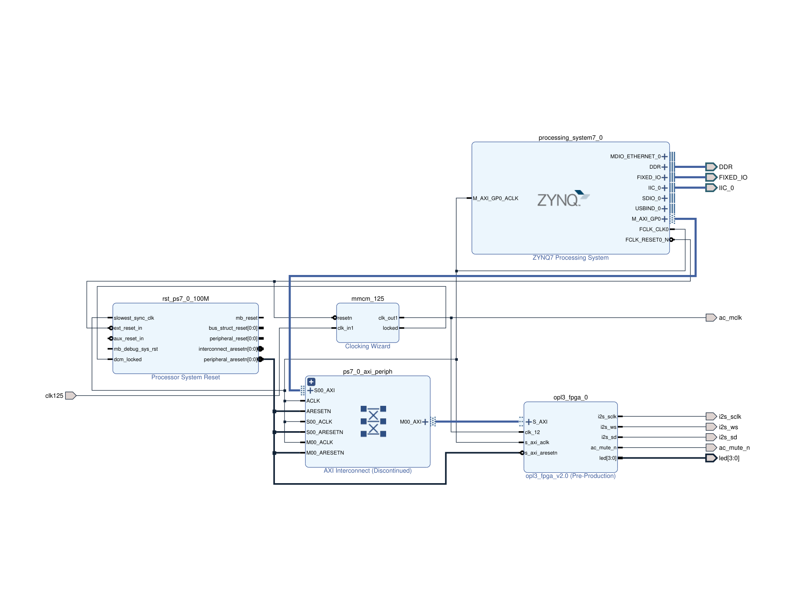
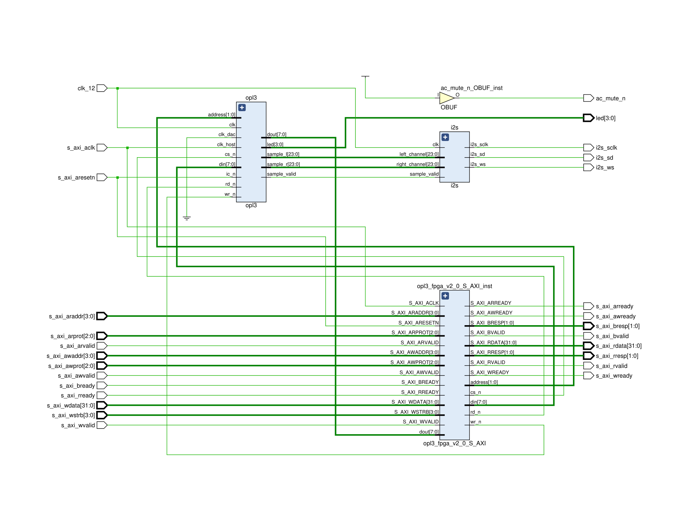
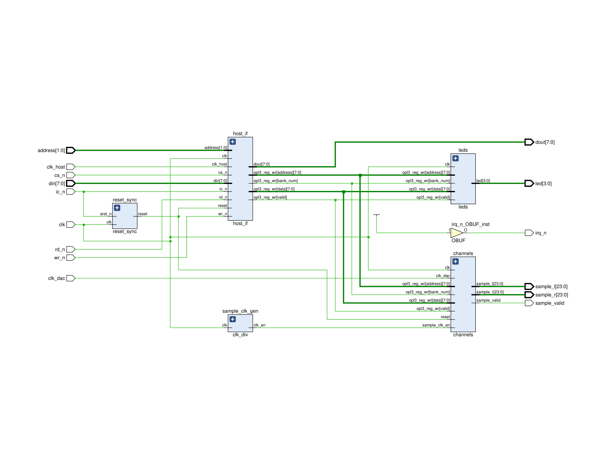
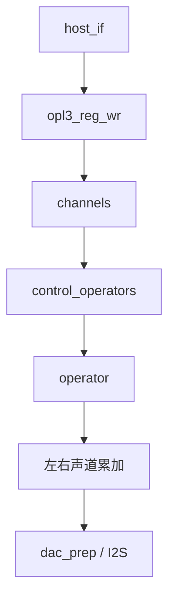
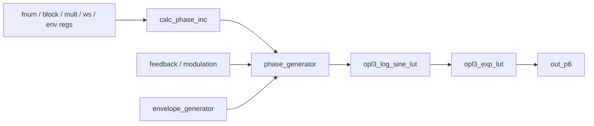
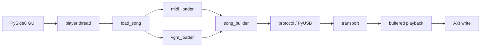

<div align="center">

# Zybo OPL3 FPGA

Zybo 平台上的 OPL3 FPGA 工程  
当前仓库整理为 `Vivado / Vitis 2025.2` 版本

<p>
  
  
  
  
  
</p>



</div>

## 上游项目

- `gtaylormb/opl3_fpga`: <https://github.com/gtaylormb/opl3_fpga>
- `SudoMaker/midi2vgm`: <https://github.com/SudoMaker/midi2vgm>

本仓库基于 `gtaylormb/opl3_fpga` 整理，补充了 `Vivado/Vitis 2025.2` 构建路径，以及 PC 侧 `.mid/.midi/.vgm/.vgz` 播放支持。

## 目录

- [项目概览](#项目概览)
- [当前范围](#当前范围)
- [快速开始](#快速开始)
- [硬件架构](#硬件架构)
- [OPL3 核心细节](#opl3-核心细节)
- [软件架构](#软件架构)
- [文件格式支持](#文件格式支持)
- [串口 CLI](#串口-cli)
- [仓库结构](#仓库结构)
- [构建与运行](#构建与运行)
- [当前状态](#当前状态)
- [限制](#限制)
- [参考资料](#参考资料)

## 项目概览

| 项目项 | 当前方案 |
| --- | --- |
| 开发板 | `Digilent Zybo (Zynq-7000)` |
| FPGA 工具链 | `Vivado 2025.2` |
| PS 软件工具链 | `Vitis 2025.2` |
| 板端运行时 | `standalone bare-metal` |
| 上位机 | `Python + PySide6 + PyUSB` |
| 默认下载方式 | `JTAG` |
| 主通信链路 | `USB Bulk` |
| 回退链路 | `UART` |
| 音频输出 | `I2S -> SSM2603` |

未纳入当前范围：

- `Linux`
- `PetaLinux`
- `USB Audio / UAC`
- 以 `BOOT.bin / SD 卡` 作为日常开发前提

## 当前范围

当前仓库包含以下整理项：

- 适配 `Vivado/Vitis 2025.2`
- 保留板端 `.dro/.imf` 播放路径
- 新增 PC 侧中文 GUI
- 支持 `.mid/.midi/.vgm/.vgz`
- 采用“预加载到板端内存后再播放”的方式
- 补充当前工程导出的 `BD / RTL` 图

## 快速开始

### 环境要求

Windows 环境建议具备：

- `Vivado 2025.2`
- `Vitis 2025.2`
- `Python 3.11+`
- Zybo JTAG 驱动
- 若使用 USB 上位机播放：为设备安装 `WinUSB`

Python 依赖：

```bash
pip install -r pc_player/requirements.txt
```

### 构建硬件

```bash
cd fpga
make bitstream
```

输出：

- `fpga/build/opl3.bit`
- `fpga/build/opl3.xsa`

### 构建板端软件

```bash
vitis -s software/vitis_builder.py
```

输出：

- `vitis_project/imfplay_port/build/imfplay_port.elf`

### JTAG 下载

```powershell
powershell -ExecutionPolicy Bypass -File software/jtag/run_jtag.ps1
```

也可以显式指定文件：

```powershell
powershell -ExecutionPolicy Bypass -File software/jtag/run_jtag.ps1 `
  -Bitstream fpga/build/opl3.bit `
  -Elf vitis_project/imfplay_port/build/imfplay_port.elf
```

### 启动上位机

源码运行：

```bash
python pc_player/main.py
```

打包版本：

- `dist/ZyboOpl3Player/ZyboOpl3Player.exe`

### 基本使用流程

1. 通过 JTAG 下载 `bitstream` 和 `ELF`
2. 将板子切换到 USB 连接方式并接入电脑
3. 打开上位机
4. 选择 USB 设备
5. 选择本地 `.mid/.midi/.vgm/.vgz`
6. 点击播放

## 硬件架构

### 顶层数据通路


### Vivado Block Design

当前工程导出的 Block Design 图如下：

<div align="center">
  
</div>

关联文件：

- [design_1.pdf](fpga/build/design_1/design_1.pdf)
- [block_design.png](docs/block_design.png)

### `opl3_fpga_v2_0`

`opl3_fpga_v2_0` 位于 PS 与 OPL3 核之间，主要包含：

- `AXI4-Lite` 从接口
- `opl3`
- `i2s`

相关源码：

- [opl3_fpga_v2_0.sv](/J:/lumia/OPL3/opl3_fpga/fpga/modules/opl3_fpga_2_0/src/opl3_fpga_v2_0.sv:1)
- [opl3_fpga_v2_0_S_AXI.v](/J:/lumia/OPL3/opl3_fpga/fpga/modules/opl3_fpga_2_0/src/opl3_fpga_v2_0_S_AXI.v:1)

RTL 图：

<div align="center">
  
</div>

关联文件：

- [opl3_fpga_v2_0_rtl.pdf](fpga/build/opl3_fpga_v2_0_rtl.pdf)

### `opl3`

`opl3` 顶层模块包含：

- `host_if`
- `clk_div`
- `channels`
- `leds`
- `timers`

相关源码：

- [opl3.sv](/J:/lumia/OPL3/opl3_fpga/fpga/modules/top_level/src/opl3.sv:1)
- [channels.sv](/J:/lumia/OPL3/opl3_fpga/fpga/modules/channels/src/channels.sv:1)
- [operator.sv](/J:/lumia/OPL3/opl3_fpga/fpga/modules/operator/src/operator.sv:1)

RTL 图：

<div align="center">
  
</div>

关联文件：

- [opl3_core_rtl.pdf](fpga/build/opl3_core_rtl.pdf)

### OPL3 核心层次



模块职责：

- `host_if`：主机寄存器接口
- `control_operators`：运算器调度与连接控制
- `operator`：相位、包络、查表等 FM 运算
- `channels`：2-op / 4-op / 鼓组与左右声道混合

## OPL3 核心细节

### 单个 operator 的数据路径

单个 `operator` 的实现位于：

- [operator.sv](/J:/lumia/OPL3/opl3_fpga/fpga/modules/operator/src/operator.sv:1)
- [phase_generator.sv](/J:/lumia/OPL3/opl3_fpga/fpga/modules/operator/src/phase_generator.sv:1)
- [envelope_generator.sv](/J:/lumia/OPL3/opl3_fpga/fpga/modules/operator/src/envelope_generator.sv:1)

从 RTL 划分上看，单个 operator 的主要路径可以概括为：



对应关系：

- `calc_phase_inc`
  - 由 `fnum`、`block`、`mult` 计算相位增量
- `phase_generator`
  - 维护 phase accumulator
  - 加入 modulation / feedback / rhythm phase
  - 生成波形查表地址
- `envelope_generator`
  - 生成随时间变化的包络值
- `opl3_log_sine_lut`
  - 计算对数正弦域幅值
- `opl3_exp_lut`
  - 从对数域恢复到线性幅值

### phase accumulator 与调制

`phase_generator.sv` 中，phase accumulator 以每个 sample 周期推进。调制量不回写到 accumulator，而是只加到最终相位上：

- `phase_acc_p3 <= phase_acc_p2 + phase_inc_p2`
- `final_phase_p3 = rhythm_phase_p3 + modulation_p[3]`

这意味着：

- 基本音高由 `phase_inc` 决定
- FM 调制只影响当前输出相位
- feedback 通过 `operator.sv` 中的 `feedback_mem` 和 `feedback_result_p1` 回送到 `phase_generator`

反馈相关实现位于：

- [operator.sv](/J:/lumia/OPL3/opl3_fpga/fpga/modules/operator/src/operator.sv:84)

### 包络发生器

`envelope_generator.sv` 将包络状态分为四个阶段：

- `ATTACK`
- `DECAY`
- `SUSTAIN`
- `RELEASE`

状态保存在 `state_mem` 中，幅度值保存在 `env_int_mem` 中。每个 operator 都有各自独立的包络状态。

包络最终输出为：

- `env_p3 <= env_int_p[2] + tl_shifted_p2 + ksl_add_p2 + (am ? am_val_p2 : 0)`

这几项分别对应：

- `env_int`：基础包络
- `tl`：Total Level
- `ksl_add`：Key Scale Level
- `am_val`：Tremolo

包络整体图：

<div align="center">
  
</div>

Attack 段局部图：

<div align="center">
  
</div>

### 波形选择

当前工程中，波形选择由 `ws` 控制。`phase_generator.sv` 中的实现分为两层：

1. 先根据 `ws` 计算 `theta_p3`
2. 再根据 `ws` 与最终相位决定 `pre_gain_p4` 和极性

相关逻辑位于：

- [phase_generator.sv](/J:/lumia/OPL3/opl3_fpga/fpga/modules/operator/src/phase_generator.sv:138)
- [phase_generator.sv](/J:/lumia/OPL3/opl3_fpga/fpga/modules/operator/src/phase_generator.sv:157)

其中：

- `ws[2]` 仅在 OPL3 模式下生效
- OPL2 模式只使用前 4 种波形
- `ws = 6` 在实现中直接输出常量 `0`
- `ws = 7` 使用相位值直接构造非正弦波形

下面这些图来自 `fpga/modules/operator/analysis/`，对应不同 `ws` 选择下导出的时域波形。

#### `ws = 0`

<div align="center">
  
</div>

#### `ws = 1`

<div align="center">
  
</div>

#### `ws = 2`

<div align="center">
  
</div>

#### `ws = 3`

<div align="center">
  
</div>

#### `ws = 4`

<div align="center">
  
</div>

#### `ws = 5`

<div align="center">
  
</div>

#### `ws = 6`

<div align="center">
  
</div>

#### `ws = 7`

<div align="center">
  
</div>

### 从 operator 到 channel

单个 operator 的输出并不会直接送到 DAC，而是先进入 `channels.sv`：

- `operator_out_mem` 保存各 operator 输出
- `control_operators` 负责 2-op / 4-op 连接方式
- `channels` 负责将各 channel 输出累加到左右声道

`channels.sv` 中同时处理：

- 2-op channel
- 4-op channel
- OPL rhythm mode
- 左右声道路由 `cha/chb/chc/chd`

对应源码：

- [channels.sv](/J:/lumia/OPL3/opl3_fpga/fpga/modules/channels/src/channels.sv:1)
- [control_operators.sv](/J:/lumia/OPL3/opl3_fpga/fpga/modules/channels/src/control_operators.sv:1)

### 从 channel 到 I2S

`channels` 产生：

- `sample_l`
- `sample_r`
- `sample_valid`

之后由：

- [i2s.sv](/J:/lumia/OPL3/opl3_fpga/fpga/modules/i2s/src/i2s.sv:1)

将左右声道样本串行化，通过：

- `i2s_sclk`
- `i2s_ws`
- `i2s_sd`

送到板载 `SSM2603`。

## 软件架构

### 总体结构



### PC 侧模块

目录：`pc_player/`

- `main.py`：GUI、设备枚举、播放线程
- `protocol.py`：USB 协议
- `vgm_loader.py`：`.vgm/.vgz` 解析
- `midi_loader.py`：MIDI 解析
- `song_builder.py`：统一构建板端预加载格式
- `midi_backend/`：`midi2vgm` backend 与 Python fallback
- `config.py`：backend 与外部工具路径配置

PC 侧播放流程：

1. 读取歌曲文件
2. 转换为 OPL 事件
3. 检查缓冲容量
4. 上传到板端
5. 触发板端本地播放

### 板端模块

目录：`software/src/`

- `main.cpp`：程序入口
- `opl_stream.cpp`：协议解析、缓冲区、预加载播放
- `transport.cpp`：USB/UART 后端选择
- `transport_usb.cpp`：USB Bulk 传输
- `transport_uart.cpp`：UART 传输
- `opl_hw.cpp`：AXI 寄存器写入
- `imfplay.cpp`：`.imf/.dro` 本地播放器
- `ssm2603.cpp`：板载 Codec 初始化

### 板端播放模型

```mermaid
sequenceDiagram
    participant PC as PC
    participant LINK as USB/UART
    participant BUF as Song Buffer
    participant SCH as Scheduler
    participant OPL as AXI->OPL3

    PC->>LINK: HELLO / ENTER_STREAM
    PC->>LINK: UPLOAD_BEGIN
    PC->>LINK: UPLOAD_CHUNK
    PC->>LINK: UPLOAD_END
    PC->>LINK: PLAY_BUFFERED
    LINK->>BUF: 写入整首歌曲事件
    BUF->>SCH: 逐事件读取 delay_us + writes
    SCH->>OPL: 按定时写入寄存器
```

### 通信接口

#### USB

当前 USB 设备参数：

- `VID = 0xCAFE`
- `PID = 0x4010`
- 传输类型：`Bulk`

若需通过 `PyUSB` 访问，Windows 下应为该设备安装 `WinUSB`。

#### UART

UART 用于：

- CLI
- USB 不可用时的回退链路

参数：

- CLI：`115200 8-N-1`
- 流模式：`921600 8-N-1`

## 文件格式支持

### MIDI

支持：

- `.mid`
- `.midi`

默认策略：

- `config.MIDI_BACKEND = "auto"`
- 优先尝试 `midi2vgm_opl3`
- 失败后回退到 Python mapper

说明文档：

- [docs/midi2vgm_backend.md](docs/midi2vgm_backend.md)

### VGM / VGZ

支持：

- `.vgm`
- `.vgz`

当前解析器已处理：

- `GD3` 偏移识别
- 等待时间累加
- OPL2 内容的 OPL3 声像位兼容

## 串口 CLI

串口 CLI 仍然保留：

```text
Welcome to the OPL3 FPGA

Type 'help' for a list of commands
>
```

命令：

- `help`
- `ls`
- `play doom_000.dro`
- `stream`

说明：

- `play` 调用板端 `.dro/.imf` 播放器
- `stream` 进入二进制传输模式，优先 USB，失败时回退 UART

## 仓库结构

```text
fpga/                    Vivado 脚本、RTL、约束、构建产物
software/src/            Zynq bare-metal 程序
software/jtag/           XSCT / JTAG 下载脚本
software/qspi/           QSPI / BOOT 相关脚本
pc_player/               PC 侧上位机
docs/                    文档、数据手册、导出图
tools/                   本地第三方工具目录
```

## 构建与运行

### 硬件

`fpga/Makefile` 当前主要目标：

- `make bd`
- `make bitstream`
- `make probes`
- `make program`

默认板型：

- `BOARD = zybo`

BD 脚本：

- `fpga/bd/vivado_2025.2_bd.tcl`

### 板端软件

`software/vitis_builder.py` 负责：

1. 创建或更新平台工程
2. 同步 `software/src`
3. 构建应用
4. 生成 `ELF`

### QSPI / BOOT

仓库中保留了 `BOOT.bin` 与 QSPI 烧录相关脚本。当前默认开发路径仍为 JTAG。

## 当前状态

当前仓库已完成并验证：

- `Vivado/Vitis 2025.2` 构建
- JTAG 下载 `bitstream + ELF`
- MIDI 播放链路
- VGM/VGZ 播放链路
- 板端 `.dro/.imf` 本地播放
- 上位机设备枚举、歌曲上传与板端触发播放

## 限制

- 不枚举为标准 USB 声卡
- GUI 中 `暂停/停止` 仍未实现为中断式板端控制
- USB 枚举仍依赖当前驱动与上电时序
- MIDI 听感取决于所选 backend 与 OPL patch
- 长歌曲受板端预加载缓冲容量限制

## 参考资料

- 原始项目：<https://github.com/gtaylormb/opl3_fpga>
- `midi2vgm`：<https://github.com/SudoMaker/midi2vgm>
- [YMF262 数据手册](docs/ymf262.pdf)
- [OPL4 数据手册](docs/opl4.pdf)
- [OPL3 数学推导](docs/opl3math/opl3math.pdf)

## 说明

- 本地历史资料目录不属于正式构建依赖
- `tools/` 用于放置本地第三方工具，默认不纳入版本管理
- README 中使用的 `BD / RTL` 图片来自当前仓库导出的实际构建结果
