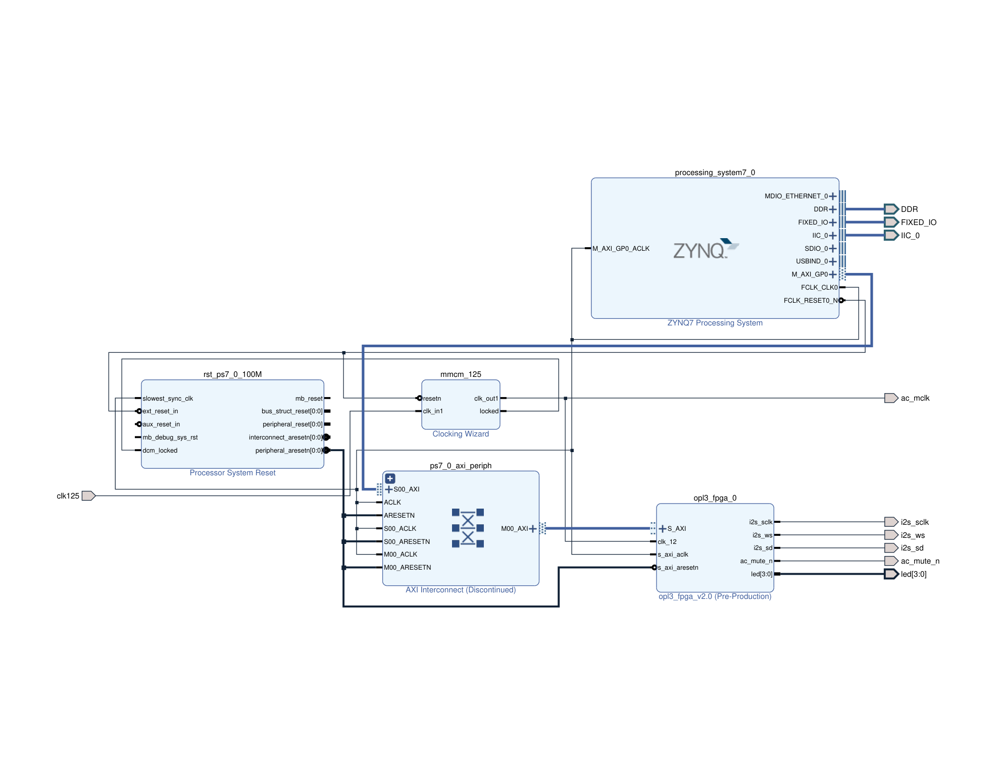
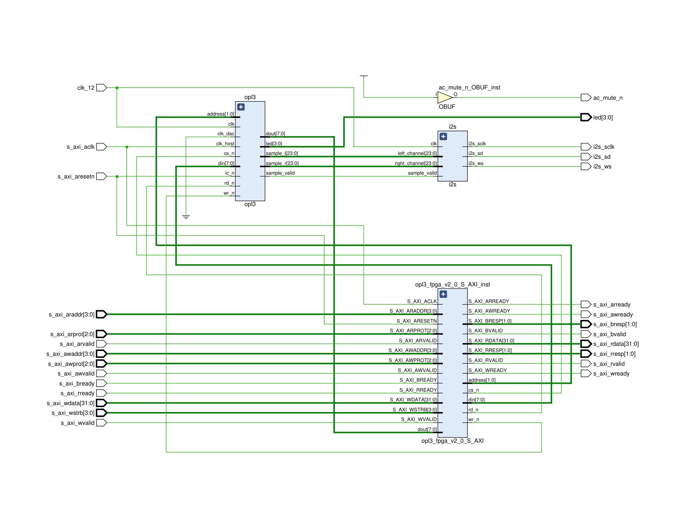
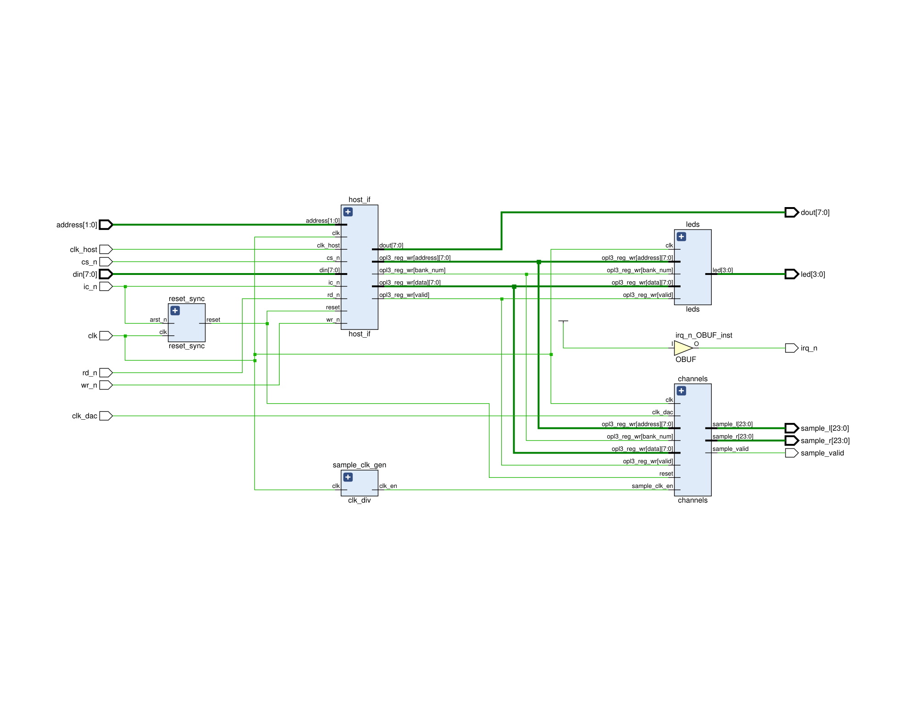
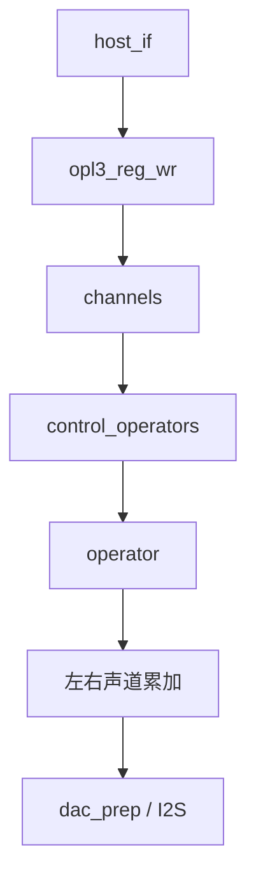

# Zybo OPL3 USB-MIDI 音源

原版 Digilent Zybo / XC7Z010 上的 OPL3 FPGA 音源，使用 Vivado / Vitis 2025.2 和独立裸机固件 `opl3_usb_midi`。Windows 自动识别为 `Zybo OPL3 MIDI`，电脑上的 MIDI 播放器负责演奏时序，板端使用 libADLMIDI bank 58 分配声部并直接写 FPGA 寄存器。

本项目统一使用标准 USB-MIDI。VGZ 先在电脑上转换为普通 MIDI，再由同一个输出设备播放；原 Bulk/UART 播放器停用。


```mermaid
flowchart LR
    A[Windows MIDI 播放器] -->|USB-MIDI 1.0| B[Zynq ARM / libADLMIDI]
    B -->|AXI 寄存器写入| C[FPGA OPL3]
    C -->|I²S| D[SSM2603 / 耳机输出]
```

## 连接与播放

1. Zybo 的 J9 USB OTG 接电脑，JP1 断开以使用 USB 外设模式。J11 为 JTAG/UART 和可选供电接口。
2. 耳机或有源音箱接 J5 Headphone Out。
3. 固件启动后 Windows 使用系统 MIDI 类驱动；播放器的输出设备选择 `Zybo OPL3 MIDI`，打开 `.mid` 即可播放。

开源播放器可选 [Cynthia](https://github.com/blaiz2023/Cynthia) 或 [Drumstick MIDI File Player](https://github.com/pedrolcl/dmidiplayer)。Cynthia 已在本机通过设备选择和外部 MIDI 文件播放测试，便携程序可从其上游仓库下载。

正常播放不需要 Python 上位机、loopMIDI 或 WinUSB 绑定。USB 接口承载 MIDI 消息，音频从板载接口输出。接口为 Full Speed、一个虚拟 cable、16 个 MIDI 通道；硬件复音由 OPL3 和音色引擎共同分配。

## 构建与启动

可直接下载本机验收的 [SD 启动镜像](firmware/usb_midi/BOOT.bin) 和 [MIDI ELF](firmware/usb_midi/opl3_usb_midi.elf)。SD 镜像复制到 FAT32 卡根目录并命名为 `BOOT.bin`；SD 冷启动的物理验收状态见下方验证说明。

在仓库根目录运行：

```powershell
$env:XILINX_VITIS = 'J:/FPGA/2025.2/Vitis'
python -B software/usb_midi/build.py
```

复用 `fpga/build/opl3.bit` 和现有导出平台 BSP/FSBL，固定库源码位于 `third_party/libadlmidi`。产物为 `build/usb_midi/opl3_usb_midi.elf`、链接 map 和 `build/usb_midi/BOOT.bin`。

JTAG 下载：

```powershell
& "$env:XILINX_VITIS/bin/xsct.bat" software/usb_midi/hardware_download.tcl
```

需要本机 `hw_server` 运行于端口 3121，并在独占板卡下载时段操作。

SD 启动：将 `build/usb_midi/BOOT.bin` 复制到 FAT32 microSD 根目录，断电后将 JP5 设为 SD，再重新上电。镜像包含 FSBL、FPGA 配置和 MIDI 应用。

详细的 Vitis 应用构建、接线、JTAG/ILA 测试和 SD 操作见 [构建与启动说明](docs/usb_midi/project.md)，已验证与待物理验证项见 [实际验证状态](docs/usb_midi/progress.md)。

## VGZ 转换

本机的 86 个 VGZ 已转换为普通 MIDI，输出到 `midi/converted` 并保留原专辑目录。音乐输入与转换结果由本地提供，`midi` 目录不纳入版本控制。首次使用转换工具需安装 Python 依赖和构建 Java 转换器：

```powershell
python -m pip install mido pyusb
python -B tools/vgz2midi.py --build-converter
python -B tools/vgz2midi.py
```

转换器构建需要 JDK（本机使用 JDK 24），运行使用 Java/Vgm3Mid 和 `mido`，对 OPL3 的两个寄存器组分别转换并合并声部。转换后的 GM 音色、包络和弯音可能与原始 VGZ 不同；具体转换依赖与通道约束见 [说明](docs/usb_midi/project.md#vgz-转-midi)。

## 固件源码

- `software/usb_midi`：USB 描述符和接收队列、MIDI 解析、实时合成、独立构建与硬件用例。
- `third_party/libadlmidi`：固定提交 `84d27bc2bdbd6dd249537a7f7d2450cbd402482e`，FPGA 后端适配说明见 `LOCAL.txt`。
- `software/src/opl_hw.cpp`、`ssm2603.cpp`：现有 AXI 寄存器访问和 Codec 初始化。
- `fpga`：现有 OPL3 RTL、AXI、I²S 及 Zynq 工程。

## 硬件架构

### 顶层数据通路


```mermaid
flowchart LR
    PC[PC] -->|USB Bulk / UART| PS[Zynq PS]
    PS -->|AXI4-Lite| WRAP[opl3_fpga_v2_0]
    WRAP -->|host_if| CORE[opl3]
    CORE -->|sample_l / sample_r| I2S[I2S]
    I2S --> CODEC[SSM2603]
    CODEC --> OUT[耳机 / Line out]
```

### Vivado Block Design

当前工程导出的 Block Design 图如下：

<div align="center">
  
</div>

关联文件：

- [design_1.pdf](fpga/build/design_1/design_1.pdf)
- [block_design.png](docs/block_design.png)

### `opl3_fpga_v2_0`

`opl3_fpga_v2_0` 位于 PS 与 OPL3 核之间，主要包含：

- `AXI4-Lite` 从接口
- `opl3`
- `i2s`

相关源码：

- [opl3_fpga_v2_0.sv](fpga/modules/opl3_fpga_2_0/src/opl3_fpga_v2_0.sv#L1)
- [opl3_fpga_v2_0_S_AXI.v](fpga/modules/opl3_fpga_2_0/src/opl3_fpga_v2_0_S_AXI.v#L1)

RTL 图：

<div align="center">
  
</div>

关联文件：

- [opl3_fpga_v2_0_rtl.pdf](fpga/build/opl3_fpga_v2_0_rtl.pdf)

### `opl3`

`opl3` 顶层模块包含：

- `host_if`
- `clk_div`
- `channels`
- `leds`
- `timers`

相关源码：

- [opl3.sv](fpga/modules/top_level/src/opl3.sv#L1)
- [channels.sv](fpga/modules/channels/src/channels.sv#L1)
- [operator.sv](fpga/modules/operator/src/operator.sv#L1)

RTL 图：

<div align="center">
  
</div>

关联文件：

- [opl3_core_rtl.pdf](fpga/build/opl3_core_rtl.pdf)

### OPL3 核心层次


```mermaid
flowchart TD
    HOST[host_if] --> REG[opl3_reg_wr]
    REG --> CH[channels]
    CH --> CTRL[control_operators]
    CTRL --> OP[operator]
    OP --> MIX[左右声道累加]
    MIX --> DAC[dac_prep / I2S]
```

模块职责：

- `host_if`：主机寄存器接口
- `control_operators`：运算器调度与连接控制
- `operator`：相位、包络、查表等 FM 运算
- `channels`：2-op / 4-op / 鼓组与左右声道混合

## OPL3 核心细节

这一节只保留模块级视角，不再展开到触发器和查找表级原理图。README 内展示三层：

1. `Zynq Block Design`
2. `opl3_fpga_v2_0` AXI 包装层
3. `opl3` 核心顶层

如果要继续往下看 `operator`、`phase_generator`、`envelope_generator` 的门级/寄存器级图，建议直接在 Vivado 中打开 `Open Elaborated Design` 或 `Open Synthesized Design` 查看。

### 1. Zynq Block Design

这一级描述的是整个板级系统如何把 PS、AXI、音频 Codec 和 OPL3 IP 连起来：

- `processing_system7_0` 负责 ARM、DDR、MIO、UART、FCLK 和 AXI 主设备
- `axi_interconnect_0` 把 PS 的 GP0 总线接到自定义 OPL3 IP
- `opl3_fpga_v2_0_0` 提供 AXI-Lite 寄存器接口，并输出 I2S 与静音控制
- `rst_ps7_0_100M` 统一管理 AXI 外设复位

<div align="center">
  
</div>

关联文件：

- [design_1.pdf](fpga/build/design_1/design_1.pdf)

### 2. `opl3_fpga_v2_0` 包装层

这一级是自定义 IP 的顶层连接图，重点是把 AXI4-Lite 写时序翻译成 OPL3 Host Bus，再把 OPL3 的并行采样送进 I2S 发射器：

- `opl3_fpga_v2_0_S_AXI`
  - 处理 `AW/W/B` 与 `AR/R` 通道
  - 生成 `address`、`din`、`cs_n`、`wr_n`、`rd_n`
- `opl3`
  - 接收 OPL3 风格寄存器写入
  - 输出 `sample_l/sample_r/sample_valid`
- `i2s`
  - 把左右声道 PCM 串行化到 `i2s_sclk/i2s_ws/i2s_sd`

<div align="center">
  
</div>

关联文件：

- [opl3_fpga_v2_0_rtl.pdf](fpga/build/opl3_fpga_v2_0_rtl.pdf)

### 3. `opl3` 核心顶层

这一级展示 FM 合成核心内部的主模块关系：

- `host_if`
  - 接收 Host Bus 寄存器访问
  - 解析地址、数据、状态寄存器和定时器寄存器
- `clk_div`
  - 依据 OPL3 采样周期产生 `sample_clk_en`
- `channels`
  - 调度全部 operator
  - 完成 2-op / 4-op / rhythm 模式组合
  - 混合左右声道采样
- `leds`
  - 输出调试状态
- `timers`
  - 模拟 OPL3 定时器和 IRQ 行为

<div align="center">
  
</div>

关联文件：

- [opl3_core_rtl.pdf](fpga/build/opl3_core_rtl.pdf)

### 模块工作原理

#### `host_if`

`host_if` 模拟的是 YMF262 的主机寄存器接口。PS 侧通过 AXI-Lite 写某个寄存器地址，包装层把这次写操作翻译为 `cs_n/wr_n/address/din`，`host_if` 再把它整理成内部统一的 `opl3_reg_wr` 事务，广播给后面的 `channels`、`timers` 和状态逻辑。

#### `channels`

`channels` 是整个合成器的数据组织中心。它不直接“存一整首歌”，而是在每个采样周期内轮流驱动全部 operator，拿到各 operator 的输出后，根据 OPL2/OPL3 模式、2-op/4-op 连接方式、鼓组模式和左右声道路由规则，把结果加到 `sample_l`、`sample_r`。

这也是为什么工程里既有 `channels.sv`，又有 `control_operators.sv`：

- `control_operators` 负责“这一拍该算哪个 operator、给它什么寄存器参数、反馈和调制输入是什么”
- `channels` 负责“operator 算完后怎样组合成 channel，再怎样落到左右声道”

#### `operator`

单个 `operator` 是 FM 合成的基本运算单元。逻辑上可以概括成：

1. `calc_phase_inc` 根据 `fnum/block/mult` 算相位步进
2. `phase_generator` 维护相位累加器，并叠加调制、反馈、节奏模式相位
3. `envelope_generator` 生成 ADSR 包络
4. `opl3_log_sine_lut` 与 `opl3_exp_lut` 把“相位 + 包络”变成最终幅值

README 不再放这一层的大图，但源码入口在：

- [operator.sv](fpga/modules/operator/src/operator.sv#L1)
- [phase_generator.sv](fpga/modules/operator/src/phase_generator.sv#L1)
- [envelope_generator.sv](fpga/modules/operator/src/envelope_generator.sv#L1)

#### 包络与波形

- 包络阶段仍是典型的 `ATTACK -> DECAY -> SUSTAIN -> RELEASE`
- 振幅控制由基础包络、`TL`、`KSL`、`Tremolo` 共同叠加
- 波形选择由 `ws` 控制，OPL2 使用前 4 种，OPL3 扩展到 8 种
- 节奏模式下，部分 operator 会切换成 `bass drum / snare / tom / cymbal / hi-hat` 专用路径

这部分更适合结合源码和波形图理解，相关分析图仍保留在：

- `fpga/modules/operator/analysis/`

## 参考资料

- FPGA 上游：[gtaylormb/opl3_fpga](https://github.com/gtaylormb/opl3_fpga)
- MIDI 音色引擎：[libADLMIDI](https://github.com/Wohlstand/libADLMIDI)
- 现有 MIDI 转 VGM 工具来源：[SudoMaker/midi2vgm](https://github.com/SudoMaker/midi2vgm)
- [Digilent Zybo 手册](https://digilent.com/reference/_media/reference/programmable-logic/zybo/zybo_rm.pdf)
- [USB-MIDI 1.0 规范](https://www.usb.org/sites/default/files/midi10.pdf)
- [YMF262 数据手册](docs/ymf262.pdf)
