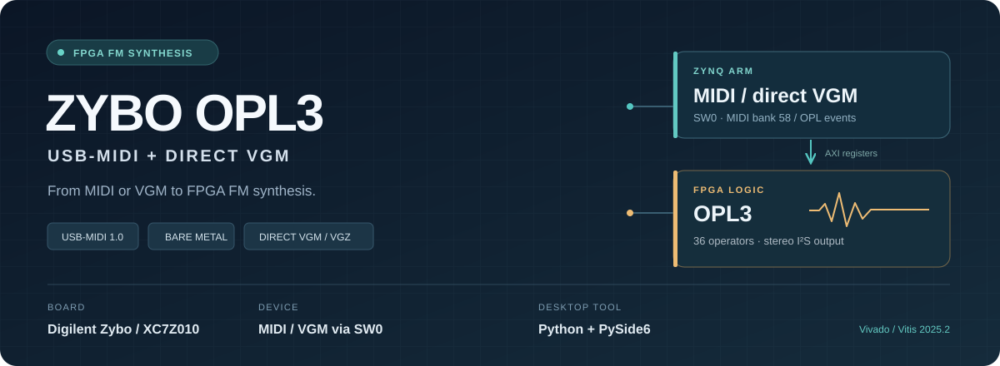
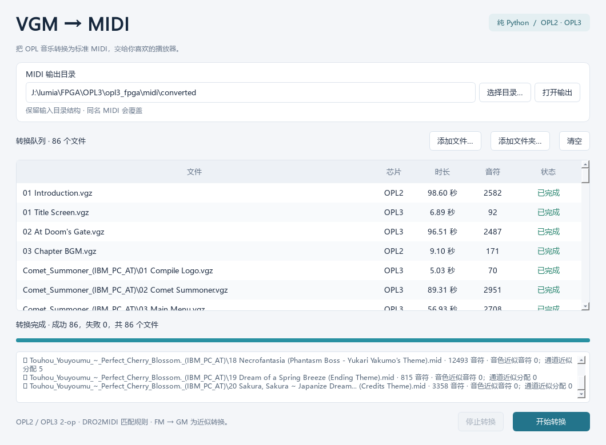
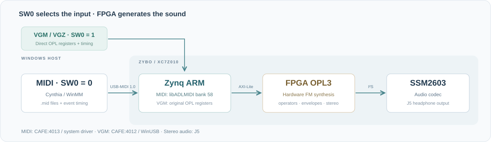

<div align="center">



# Zybo OPL3

**把 Zybo 变成 Windows 可直接识别的 USB-MIDI FM 音源。**

标准 MIDI 输入 · FPGA OPL3 合成 · 板载立体声音频输出 · VGM/VGZ 桌面转换器

<p>
  
  
  
  
  
</p>

[快速上手](#快速上手) · [转换器 GUI](#vgmvgz-转换器) · [硬件架构](#硬件架构) · [验证结果](#验证结果) · [源码构建](#源码构建)

</div>

电脑上的播放器把 MIDI 演奏消息发送给 `Zybo OPL3 MIDI`。Zynq ARM 上的 libADLMIDI 负责音色和声部分配，FPGA OPL3 负责 FM 合成，声音从 SSM2603 的耳机接口输出。已有 `.mid` 可直接播放；OPL2/OPL3 的 2-op `.vgm`、`.vgz` 可以先用 Python 工具转换为标准 MIDI。

## 项目亮点

| 能力 | 实际行为 |
| --- | --- |
| **Windows 原生 MIDI** | USB-MIDI 1.0 类设备，Windows 使用系统 MIDI 驱动，播放器直接选择输出设备。 |
| **硬件 FM 合成** | ARM 写 AXI 寄存器，OPL3 运算与立体声采样在 FPGA 内完成。 |
| **固定音色引擎** | libADLMIDI 固定版本、bank 58、单 OPL3、硬件左右声像。 |
| **实时 MIDI 演奏** | Note On/Off、力度、音色、控制器、弯音、触后及库支持的 SysEx。 |
| **桌面批量转换** | 文件/文件夹选择、目录结构保留、进度、停止和逐文件错误显示。 |
| **实测结果可查** | 30 分钟 MIDI 压力播放、86 首 VGZ 转换、协议测试及 ILA 数字波形验证。 |

## 快速上手

### 1. 准备开发板

适用硬件：**原版 Digilent Zybo / XC7Z010 / SSM2603**。

| 接口 / 跳线 | 用途与配置 |
| --- | --- |
| **J9 USB OTG** | 接 Windows，承载 USB-MIDI 数据；JP1 断开，使用 USB 外设模式。 |
| **J11 USB** | JTAG/UART 下载与调试接口，亦可按板卡电源配置供电。 |
| **J5 Headphone Out** | 接耳机或有源音箱。 |
| **JP5** | 选择启动模式；SD 启动时在断电状态下设置为 SD。 |

预编译产物：

| 文件 | 用途 |
| --- | --- |
| [BOOT.bin](firmware/usb_midi/BOOT.bin) | SD 启动镜像，包含 FSBL、OPL3 bitstream 和 MIDI 固件。 |
| [opl3_usb_midi.elf](firmware/usb_midi/opl3_usb_midi.elf) | MIDI 裸机应用 ELF，供匹配的平台和 FPGA 配置使用。 |

在 GitHub 文件页面点击 **Download raw file** 下载二进制。将 `BOOT.bin` 放到 FAT32 microSD 根目录，断电设置启动跳线，再给板卡供电。JTAG 下载和平台准备步骤见 [构建与连接说明](docs/usb_midi/project.md)。

> 镜像打包、JTAG 启动和 Windows 枚举已验证。脱离 JTAG 的 SD 卡冷启动仍待实物验收。

### 2. 选择 MIDI 输出并播放

1. 固件启动后，Windows 的 MIDI 输出设备中出现 **`Zybo OPL3 MIDI`**。
2. 在 [Cynthia](https://github.com/blaiz2023/Cynthia) 的 Settings 中选择该设备。
3. 将 `.mid` 加入播放列表并开始播放，音频从 **J5** 输出。

Cynthia 已完成本机设备选择和外部 MIDI 文件播放验证。[Drumstick MIDI File Player](https://github.com/pedrolcl/dmidiplayer) 的界面兼容性尚未实测。

正常 MIDI 播放由 Windows 播放器完成，不需要运行转换器。USB 接口传输演奏消息，模拟音频从开发板输出。

### 3. 启动 VGM/VGZ 转换器

Windows / PowerShell，在目标目录运行：

```powershell
git clone --branch usb-midi-opl3 https://github.com/ryujou/zybo-opl3-fpga.git
cd zybo-opl3-fpga
python -m venv .venv
.\.venv\Scripts\python.exe -m pip install mido PySide6
.\.venv\Scripts\python.exe -B tools/vgz2midi_gui.py
```

在 GUI 中添加文件或文件夹、指定输出目录、点击 **开始转换**，随后用同一 MIDI 播放器打开生成的 `.mid`。本机验证环境为 Python 3.11 和 Windows 11。

## VGM/VGZ 转换器

<div align="center">
  
  <p><em>实际运行截图：86 个文件全部完成转换。</em></p>
</div>

- **批量输入**：选择多个文件，或递归扫描文件夹中的 `.vgm` / `.vgz`。
- **清晰进度**：显示文件、芯片、时长、音符数和处理状态；单个失败会显示原因并继续处理其余文件。
- **保留目录**：输出 `.mid` 保持输入子目录结构；同名 MIDI 会覆盖，输出路径冲突会明确报错。
- **可停止**：转换在工作线程执行，窗口保持响应，支持取消。
- **bank 58 匹配**：根据 FM 参数匹配音色，保留音高、弯音、电平、声像和 OPL 节奏鼓组消息。

命令行使用相同核心，只依赖 `mido`：

```powershell
# 把自己的音乐放到 music 目录，再批量转换：
.\.venv\Scripts\python.exe -B tools/vgz2midi.py --source ".\music" --output ".\midi\converted"

# 也可以指定单个文件：
.\.venv\Scripts\python.exe -B tools/vgz2midi.py --source ".\music\example.vgz" --output ".\midi\converted"
```

**支持范围：OPL2/YM3812、OPL3/YMF262 的 2-op 音乐。** 4-op、双芯片及非 OPL 芯片指令会报错。OPL3 两组寄存器的 18 个声部均参与转换；独立音色、音量、声像和弯音状态超过 15 组时，会近似合并 MIDI 通道。

FM 音色映射为 GM 音色仍属于近似转换，包络和声部合并也可能改变听感；输出不承诺重现原始波形。时间使用整数 44.1 kHz 样本计数，完整保留单次播放时长并补齐 Note Off。

音乐输入与生成的 MIDI 由使用者提供，`midi` 目录不纳入版本控制。详见 [转换说明](docs/usb_midi/project.md#vgz-转-midi)。

## 硬件架构



| 层级 | 职责 | 源码入口 |
| --- | --- | --- |
| **USB-MIDI 固件** | 枚举、接收队列、事件解析、实时推进与异常静音 | [software/usb_midi](software/usb_midi) |
| **音色引擎** | GM 音色、控制器处理、声部分配与 OPL 寄存器写入 | [third_party/libadlmidi](third_party/libadlmidi) |
| **AXI 包装层** | AXI4-Lite 写入转 OPL3 host bus，采样转 I²S | [opl3_fpga_v2_0.sv](fpga/modules/opl3_fpga_2_0/src/opl3_fpga_v2_0.sv) |
| **OPL3 核** | operator 调度、包络、相位、波形与立体声混合 | [opl3.sv](fpga/modules/top_level/src/opl3.sv)、[operator.sv](fpga/modules/operator/src/operator.sv) |
| **音频初始化** | SSM2603 配置 | [ssm2603.cpp](software/src/ssm2603.cpp) |

### Vivado Block Design


PS 的 AXI 主接口连接 OPL3 IP；自定义包装层输出左右声道的 I²S 数据。OPL3 核的 36 个 operator 在采样周期内调度，完成 2-op、4-op 和节奏模式的运算与混合。

<details>
<summary><strong>查看 AXI 包装层与 OPL3 核的 RTL 图</strong></summary>

#### AXI 包装层


`opl3_fpga_v2_0_S_AXI` 处理 AXI 访问并生成 OPL3 host bus 信号；`opl3` 产生左右声道采样，`i2s` 完成串行输出。

#### OPL3 核


`host_if` 将主机写入广播为寄存器事务；`control_operators` 调度运算器；`channels` 组合各 operator 输出并混合左右声道。

深入 FM 运算：[phase_generator.sv](fpga/modules/operator/src/phase_generator.sv)、[envelope_generator.sv](fpga/modules/operator/src/envelope_generator.sv)、[波形与包络分析图](fpga/modules/operator/analysis)。

</details>

### 固件参数

| 参数 | 设置 |
| --- | --- |
| USB | MIDI 1.0 / Full Speed / EP1 OUT、IN / 64 字节最大包长 |
| MIDI | 一个虚拟 cable，16 个通道；通道 10 为 GM 鼓组；IN 空闲 |
| 设备标识 | `Zybo OPL3 MIDI` · VID/PID `CAFE:4013`（本地试验） |
| libADLMIDI | 固定提交 `84d27bc2bdbd6dd249537a7f7d2450cbd402482e` |
| 合成设置 | 单 OPL3、bank 58、volume model 0、硬件左右声像 |
| 缓冲 | 8 KiB USB-MIDI 队列、1 KiB SysEx 组包 |
| 内存预留 | 4 MiB heap、64 KiB 主栈 |

16 个 MIDI 通道是演奏消息的逻辑通道，实际复音由 OPL3 和音色引擎分配。中断负责收包入队，主循环负责解析与合成；约每 1 ms 按实际经过时间推进音色引擎。队列溢出、USB 复位或取消配置会触发静音和状态清理。

## 验证结果

验证环境：**原版 Zybo / XC7Z010 · Windows 11 Pro 26200 · Vivado / Vitis 2025.2**。完整记录见 [实际验证状态](docs/usb_midi/progress.md)。

| 验证项 | 结果 |
| --- | --- |
| Windows 枚举 | 系统 `usbaudio` 驱动，自动识别为 `Zybo OPL3 MIDI` |
| 播放器 | WinMM 与 Cynthia 完成外部 MIDI 播放 |
| 连续播放 | **1800 秒 / 30 分钟**，52391 个 USB-MIDI 事件全部处理 |
| 错误计数 | 队列溢出、畸形输入、USB 发送错误均为 **0** |
| 板端排队 | 实测最大 **756 µs** |
| 单事件处理 | 实测最大 **106 µs** |
| Python 转换 | **86 / 86**，376581 个音符、1237114 个事件；时长一致、Note On/Off 配对完整 |
| GUI | 整批转换、窗口响应、取消、报错与失败后继续处理均通过 |
| 数字音频 | ILA 验证左右声像、停止后静音、OPL3 PCM 与 I²S 对应关系 |

排队和处理时间是板端实测值，不包含 Windows 调度、USB 到达回调前的时间或模拟音频延迟。当前 Python 转换输出已完成主机验证；板卡两首演奏与波形验收使用的是单独记录的 MIDI 样本。

**仍待实物验证：**耳机/音箱听感与模拟电平、实际 USB 拔插、SD 冷启动；当前 Python 转换输出的板卡演奏尚未复测。Falcosoft 与 Drumstick 界面兼容性尚未实测。

## 源码构建

### ARM 固件与 SD 镜像

构建依赖 Vivado/Vitis **2025.2** 及匹配的导出平台。以下生成文件由本机平台提供，不随仓库分发：

- `fpga/build/opl3.bit`
- `vitis_project/opl3_platform/export/opl3_platform` 中的 BSP、XPFM 和 FSBL

准备匹配平台后，在仓库根目录运行，将工具链路径改为自己的安装位置：

```powershell
$env:XILINX_VITIS = 'J:/FPGA/2025.2/Vitis'
python -B software/usb_midi/build.py
```

产物位于 `build/usb_midi`：`opl3_usb_midi.elf`、链接 map、`BOOT.bin`。固定版本 libADLMIDI 源码已纳入仓库。

```powershell
# 创建并构建独立 Vitis 应用：
& "$env:XILINX_VITIS/bin/vitis.bat" -s software/usb_midi/vitis_app.py

# JTAG 下载：需 hw_server 运行于 3121，且独占板卡下载时段。
& "$env:XILINX_VITIS/bin/xsct.bat" software/usb_midi/hardware_download.tcl
```

详细平台、启动和硬件用例见 [构建与连接说明](docs/usb_midi/project.md)。

### 主机测试

```powershell
# Python 转换器的 7 项协议与 MIDI 测试：
.\.venv\Scripts\python.exe -B tools/test_vgz2midi.py

# 固件原生协议/合成测试：需原生 GCC 或 LLVM-MinGW。
# g++ 位于 PATH，或通过 CXX / --host-cxx 指定。
python -B software/usb_midi/build.py --test
```

## 代码导航

| 路径 | 内容 |
| --- | --- |
| [tools/vgz2midi.py](tools/vgz2midi.py) | 纯 Python VGM/VGZ 解码、音色匹配与 MIDI 输出 |
| [tools/vgz2midi_gui.py](tools/vgz2midi_gui.py) | PySide6 桌面 GUI |
| [tools/opl_gm_bank58.json](tools/opl_gm_bank58.json) | 固定 bank 58 的 FM 音色匹配数据 |
| [software/usb_midi](software/usb_midi) | 裸机 MIDI 固件、独立构建、主机和硬件用例 |
| [fpga](fpga) | OPL3 RTL、AXI、I²S 与 Zynq 工程 |
| [third_party/libadlmidi](third_party/libadlmidi) | 固定版本音色与声部分配库 |
| [firmware/usb_midi](firmware/usb_midi) | 预编译 ELF 与 SD 镜像 |
| [docs/usb_midi](docs/usb_midi) | 确定需求、平台说明与实际验证状态 |

## 致谢与许可证

FPGA 核来自 [Greg Taylor / opl3_fpga](https://github.com/gtaylormb/opl3_fpga)，音色与实时 MIDI 引擎使用 [libADLMIDI](https://github.com/Wohlstand/libADLMIDI)。固定库版本的 FPGA 后端适配见 [LOCAL.txt](third_party/libadlmidi/LOCAL.txt)。

Python 转换器、GUI 与匹配表按 **GPL-3.0-or-later** 提供，许可证文本见 [GPL-3](third_party/libadlmidi/LICENSE.GPL-3.txt)。OPL3 RTL 保留上游 **LGPL-3.0-or-later** 声明；其余来源模块与依赖遵循各文件和目录内的许可证。

参考资料：[Digilent Zybo 手册](https://digilent.com/reference/_media/reference/programmable-logic/zybo/zybo_rm.pdf) · [USB-MIDI 1.0 规范](https://www.usb.org/sites/default/files/midi10.pdf) · [YMF262 数据手册](docs/ymf262.pdf)
